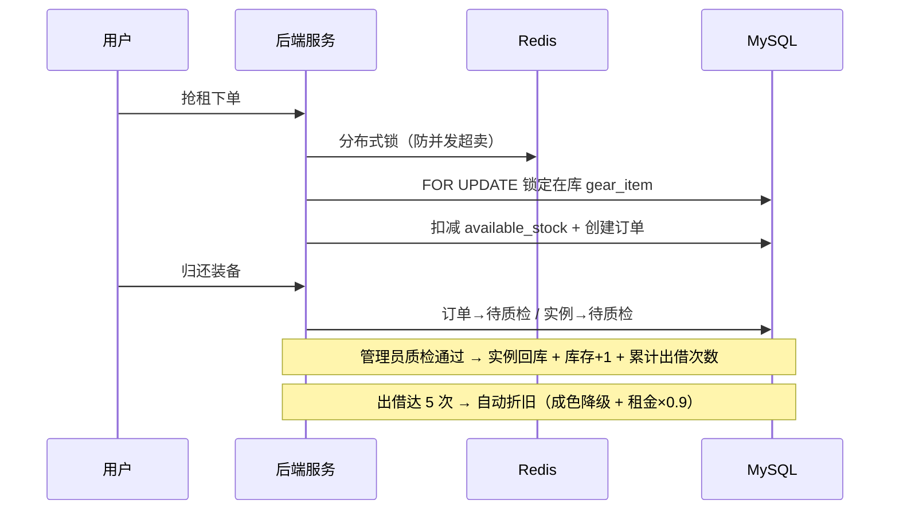
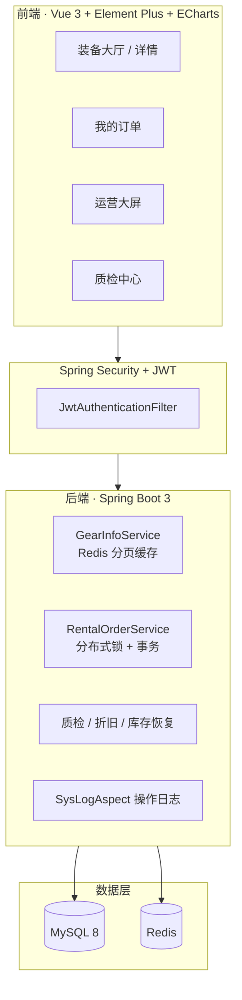

# 山行 · 户外装备租赁系统

<p align="center">
  <strong>Spring Boot 3 全栈实战项目</strong><br/>
  面向真实租赁场景的 SPU → SKU/SN 资产追踪 · 高并发抢租 · 质检闭环 · 运营可视化
</p>

<p align="center">
  <a href="https://github.com/Ckj6818/outdoor-gear-rental"></a>
  
  
  
  
  
  
</p>

<p align="center">
  <a href="#-项目概述">项目概述</a> ·
  <a href="#-功能一览">功能一览</a> ·
  <a href="#-技术亮点">技术亮点</a> ·
  <a href="#-快速开始">快速开始</a> ·
  <a href="docs/DEMO.md">3 分钟体验</a>
</p>

---

## 📌 项目概述

**山行（Outdoor Gear Rental）** 是一套完整的户外装备租赁业务系统，模拟真实租赁企业的核心流程：

> **浏览选品 → 高并发抢租 → 支付借出 → 归还 → 质检 → 库存恢复 / 维修 → 资产折旧 → 运营分析**

与常见的「只按数量扣库存」Demo 不同，本项目实现了 **装备实例级（SKU/SN）追踪**：每一件背包、帐篷拥有唯一序列号，借还全程可溯源，更贴近真实资产管理场景。

| 维度 | 说明 |
|------|------|
| **项目类型** | 全栈 Web 应用（前后端分离） |
| **业务领域** | O2O 租赁 / 库存与资产管理 |
| **代码规模** | 后端 Java 30+ 类 · 前端 Vue 多页面 · MySQL 5 张核心表 |
| **适用场景** | 校招 / 实习作品集 · 全栈 / 后端 / 前端岗位技术展示 |

**仓库地址：** https://github.com/Ckj6818/outdoor-gear-rental

---

## ✨ 功能一览

### 用户端

- **装备大厅**：分类筛选、关键词搜索、商品卡片 hover 换图、详情弹窗
- **装备详情**：品牌 / 成色 / 库存、**技术参数**（分号分隔解析展示）、**使用须知**
- **租赁下单**：选租期、模拟支付、订单列表与状态跟踪
- **归还流程**：用户归还后进入「待质检」，与后台质检联动

### 管理端

- **后台质检中心**：待质检订单处理（通过 → 恢复库存；异常 → 维修/赔偿流程）
- **运营数据大屏**：ECharts 折线图 / 饼图展示租赁趋势与品类占比
- **装备管理**：管理员 CRUD（`@PreAuthorize` 方法级权限控制）

### 业务流程图



---

## 🛠 技术亮点

> 以下能力均可通过代码与本地运行验证，详见 [docs/DEMO.md](docs/DEMO.md)。

| 类别 | 实现方案 | 业务价值 |
|------|----------|----------|
| **库存模型** | `gear_info`（SPU）+ `gear_item`（SKU/SN 实例） | 单件装备全生命周期追踪 |
| **高并发抢租** | Redisson 分布式锁 + DB 行锁 + 原子扣减 | 防止超卖，保证库存一致性 |
| **缓存优化** | Spring Cache + Redis，`@Cacheable` / `@CacheEvict` | 装备大厅分页读多写少场景加速 |
| **安全认证** | JWT + Spring Security + BCrypt | 无状态鉴权，密码安全存储 |
| **权限控制** | RBAC + `@PreAuthorize("hasRole('ADMIN')")` | 管理接口与用户接口隔离 |
| **操作审计** | 自定义 `@LogOperation` + AOP 切面 | 记录操作人、IP、耗时、接口路径 |
| **资产折旧** | 质检通过后 `rent_count++`，达阈值自动降级 | 模拟真实租赁资产损耗规则 |
| **前端体验** | Vue 3 Composition API + Element Plus + ECharts | 商业化 UI、响应式布局、管理大屏 |

---

## 🏗 系统架构



---

## 💻 技术栈

| 层级 | 技术 |
|------|------|
| **后端** | Java 17 · Spring Boot 3.2 · Spring Security · Spring AOP · Spring Cache |
| **持久层** | MyBatis-Plus 3.5 · MySQL 8 |
| **中间件** | Redis · Redisson（分布式锁，不可用时降级本地锁） |
| **认证** | JWT（jjwt 0.12）· BCrypt |
| **前端** | Vue 3.5 · Vue Router 4 · Vite 5 · Element Plus · Axios · ECharts 6 |

---

## 🚀 快速开始

### 环境要求

JDK 17+ · Maven 3.9+ · Node.js 18+ · MySQL 8.0+ · Redis 6+（可选）

### 1. 克隆 & 初始化数据库

```bash
git clone https://github.com/Ckj6818/outdoor-gear-rental.git
cd outdoor-gear-rental

mysql -u root -p < sql/init.sql
mysql -u root -p outdoor_gear_rental < sql/alter_gear_item_sku.sql
mysql -u root -p outdoor_gear_rental < sql/alter_gear_rent_count.sql
mysql -u root -p outdoor_gear_rental < sql/alter_gear_specifications.sql
mysql -u root -p outdoor_gear_rental < sql/update_password_bcrypt.sql
```

> 已有数据库时，按需执行 `sql/` 目录下的增量脚本即可。

### 2. 启动后端

```powershell
# Windows PowerShell（按实际 MySQL 密码修改）
$env:MYSQL_PASSWORD = "123456"
mvn spring-boot:run
```

后端默认：**http://localhost:8081**

### 3. 启动前端

```bash
cd frontend
npm install
npm run dev
```

前端默认：**http://localhost:5173**（Vite 代理 `/api` → `8081`）

### 4. 测试账号

| 角色 | 用户名 | 密码 | 说明 |
|------|--------|------|------|
| 管理员 | `admin` | `123456` | 运营大屏 · 质检中心 · 装备管理 |
| 普通用户 | `zhangsan` | `123456` | 浏览 · 下单 · 支付 · 归还 |
| 普通用户 | `lisi` | `123456` | 同上 |

---

## 📂 项目结构

```
outdoor-gear-rental/
├── sql/                              # 数据库脚本（init + 增量迁移）
├── docs/
│   └── DEMO.md                       # 3 分钟快速体验（面向 HR / 面试官）
├── src/main/java/com/outdoor/rental/
│   ├── annotation/                   # @LogOperation 操作日志注解
│   ├── aspect/                       # AOP 切面
│   ├── config/                       # Security / Redis / JWT 配置
│   ├── controller/                   # REST API
│   ├── entity/                       # gear_info / gear_item / rental_order …
│   ├── mapper/                       # MyBatis-Plus + XML
│   └── service/                      # 业务层（含事务与分布式锁）
└── frontend/
    ├── src/api/                      # Axios 接口封装
    ├── src/views/                    # GearList / MyOrders / admin/*
    ├── src/components/               # GearCard 等公共组件
    └── public/images/gears/          # 装备展示图（70+ SKU）
```

---

## 🔌 主要 API

| 方法 | 路径 | 说明 | 权限 |
|------|------|------|------|
| POST | `/api/auth/login` | 登录获取 JWT | 公开 |
| GET | `/api/gears` | 装备分页（Redis 缓存） | 公开 |
| POST | `/api/orders` | 抢租下单 | 登录用户 |
| PUT | `/api/orders/{id}/pay` | 模拟支付 | 登录用户 |
| PUT | `/api/orders/{id}/return` | 归还（进入待质检） | 登录用户 |
| GET | `/api/admin/orders` | 全量订单 | ADMIN |
| POST | `/api/admin/orders/inspect` | 质检闭环 | ADMIN |
| GET | `/api/admin/dashboard/stats` | 运营大屏数据 | ADMIN |

---

## 📋 业务状态说明

<details>
<summary><strong>订单状态</strong></summary>

| 值 | 含义 |
|----|------|
| 0 | 待支付 |
| 1 | 借出中 |
| 2 | 已逾期 |
| 3 | 已归还 |
| 4 | 待质检 |
| 5 | 异常完结 / 需赔偿 |

</details>

<details>
<summary><strong>装备实例状态（gear_item）</strong></summary>

| 值 | 含义 |
|----|------|
| 0 | 在库 |
| 1 | 借出中 |
| 2 | 待质检 |
| 3 | 维修中 |
| 4 | 报废 |

</details>

---

## 👤 作者

**GitHub：** [@Ckj6818](https://github.com/Ckj6818)

个人全栈实战项目，涵盖数据库设计、后端业务、前端交互与工程化实践。  
欢迎 Star / Fork，如有问题请提 [Issue](https://github.com/Ckj6818/outdoor-gear-rental/issues)。

---

## 📄 License

本项目采用 [MIT License](LICENSE) 开源。
