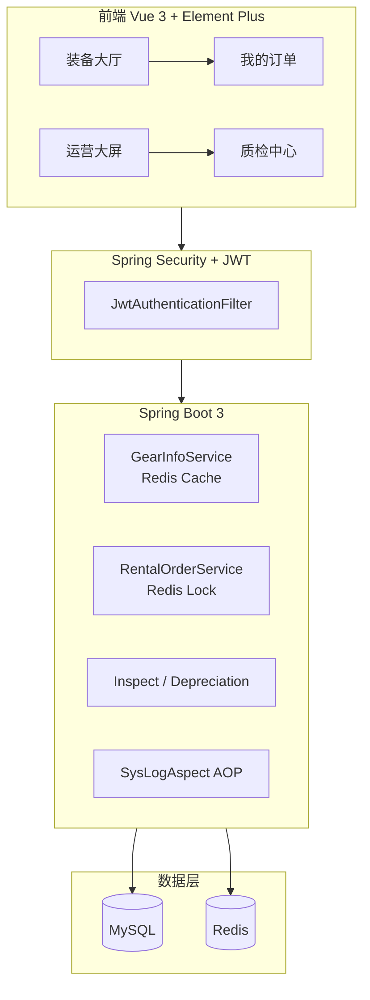

# 山行 · 户外装备租赁系统

> 面向企业级实训场景的 **SPU → SKU/SN 全链路租赁平台**  
> Spring Boot 3 + Vue 3 + Redis + JWT + MyBatis-Plus

[](https://openjdk.org/)
[](https://spring.io/projects/spring-boot)
[](https://vuejs.org/)
[](https://redis.io/)
[](https://www.mysql.com/)
[](LICENSE)

---

## 项目简介

**山行 Outdoor Gear Rental** 是一套完整的户外装备租赁业务系统，覆盖「浏览选品 → 高并发抢租 → 支付借出 → 归还 → 质检闭环 → 资产折旧 → 运营可视化」全流程。

相比传统按数量（SPU）管理库存的方案，本系统升级为 **装备实例级（SKU/SN）追踪**：每一件背包、帐篷都有唯一序列号，借还全程可溯源，更贴近真实租赁企业的资产管理需求。

**GitHub 仓库：** https://github.com/Ckj6818/outdoor-gear-rental

---

## 核心亮点（答辩向）

| 模块 | 能力说明 |
|------|----------|
| **SKU/SN 追踪** | `gear_item` 实例表 + 唯一 `sn_code`，下单时 `FOR UPDATE` 锁定在库实例 |
| **高并发抢租** | Redis 分布式锁（Redisson）+ 数据库原子扣减，防超卖 |
| **质检闭环** | 归还 → 待质检 → 管理员质检通过/异常 → 库存恢复或转维修 |
| **资产折旧** | 累计出借 5 次自动降级成色、日租金下调 10% |
| **Redis 缓存** | 装备大厅分页 `@Cacheable`，写操作/库存变更自动 `@CacheEvict` |
| **RBAC 权限** | JWT + `@PreAuthorize("hasRole('ADMIN')")` 方法级细粒度控制 |
| **运营大屏** | ECharts 折线/饼图 + Mock 统计数据，管理员可视化决策 |
| **AOP 审计** | `@LogOperation` 切面记录操作人、IP、耗时、接口路径 |

---

## 系统架构



---

## 技术栈

### 后端

- **Java 17** · Spring Boot 3.2.5 · Spring Security · Spring AOP · Spring Cache
- **MyBatis-Plus 3.5** · MySQL 8
- **Redis** · Redisson（分布式锁，不可用时降级本地锁）
- **JWT（jjwt 0.12）** · BCrypt 密码加密

### 前端

- **Vue 3.5** · Vue Router 4 · Vite 5
- **Element Plus 2.8** · ECharts 6
- **Axios** · Lenis 平滑滚动

---

## 业务状态机

### 订单状态

| 值 | 含义 |
|----|------|
| 0 | 待支付 |
| 1 | 借出中 |
| 2 | 已逾期 |
| 3 | 已归还 |
| 4 | 待质检 |
| 5 | 异常完结/需赔偿 |

### 装备实例状态（`gear_item`）

| 值 | 含义 |
|----|------|
| 0 | 在库 |
| 1 | 借出中 |
| 2 | 待质检 |
| 3 | 维修中 |
| 4 | 报废 |

---

## 快速开始

### 环境要求

- JDK 17+
- Maven 3.9+
- Node.js 18+
- MySQL 8.0+
- Redis 6+（可选，缓存与分布式锁；未启动时锁降级为本地锁）

### 1. 初始化数据库

```bash
mysql -u root -p < sql/init.sql
mysql -u root -p outdoor_gear_rental < sql/alter_gear_item_sku.sql
mysql -u root -p outdoor_gear_rental < sql/alter_gear_rent_count.sql
mysql -u root -p outdoor_gear_rental < sql/update_password_bcrypt.sql
```

> 若数据库已存在，按需执行 `sql/` 下的增量迁移脚本即可。

### 2. 启动后端

```bash
# Windows PowerShell 示例（按实际 MySQL 密码修改）
$env:MYSQL_PASSWORD = "123456"
mvn spring-boot:run
```

后端默认端口：**8081**

### 3. 启动前端

```bash
cd frontend
npm install
npm run dev
```

前端默认端口：**5173**（Vite 代理 `/api` → `http://localhost:8081`）

### 4. 访问系统

| 地址 | 说明 |
|------|------|
| http://localhost:5173 | 用户端 / 管理端入口 |
| http://localhost:5173/login | 登录页 |

---

## 测试账号

| 角色 | 用户名 | 密码 | 权限 |
|------|--------|------|------|
| 管理员 | `admin` | `123456` | 运营大屏、质检中心、装备 CRUD |
| 普通用户 | `zhangsan` | `123456` | 浏览、下单、支付、归还 |
| 普通用户 | `lisi` | `123456` | 同上 |

管理员登录后，点击右上角头像 → **运营数据大屏** / **后台质检中心**。

---

## 主要 API

| 方法 | 路径 | 说明 | 权限 |
|------|------|------|------|
| POST | `/api/auth/login` | 登录获取 JWT | 公开 |
| GET | `/api/gears` | 装备分页（Redis 缓存） | 公开 |
| POST | `/api/orders` | 抢租下单 | 登录用户 |
| PUT | `/api/orders/{id}/pay` | 模拟支付 | 登录用户 |
| PUT | `/api/orders/{id}/return` | 归还（进入待质检） | 登录用户 |
| GET | `/api/admin/orders` | 全量订单 | ADMIN |
| POST | `/api/admin/orders/inspect` | 质检闭环 | ADMIN |
| GET | `/api/admin/dashboard/stats` | 运营大屏数据 | ADMIN |

---

## 项目结构

```
├── sql/                          # 数据库脚本（init + 增量迁移）
├── src/main/java/com/outdoor/rental/
│   ├── annotation/               # @LogOperation
│   ├── aspect/                   # SysLogAspect AOP 切面
│   ├── config/                   # Security / Redis / JWT
│   ├── controller/               # REST API
│   ├── entity/                   # 实体（gear_info / gear_item / rental_order）
│   ├── mapper/                   # MyBatis-Plus Mapper
│   └── service/                  # 业务层 + 事务
└── frontend/
    ├── src/api/                  # Axios 接口封装
    ├── src/views/                # 页面（GearList / MyOrders / admin/*）
    └── src/components/           # 公共组件
```

---

## 演示建议（答辩流程）

1. **普通用户** `zhangsan` 登录 → 装备大厅搜索 → 下单抢租 → 支付 → 归还  
2. **管理员** `admin` 登录 → 质检中心处理待质检订单（通过 / 异常）  
3. 打开 **运营数据大屏** 展示 ECharts 可视化  
4. 后端控制台展示 `[操作日志]` AOP 输出（下单 / 归还 / 质检）  
5. 说明 SKU 实例锁定、Redis 锁、缓存失效策略

---

## 作者

实训项目 · [Ckj6818/outdoor-gear-rental](https://github.com/Ckj6818/outdoor-gear-rental)

如有问题欢迎提 Issue。
