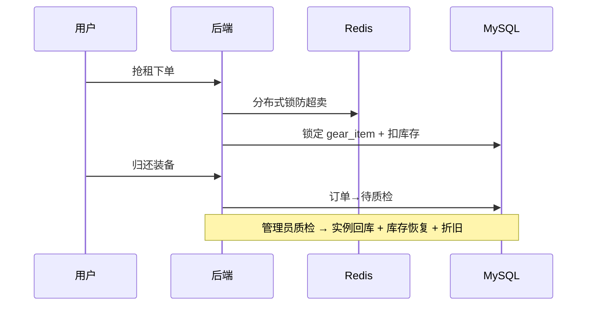

# 山行 · 户外装备租赁系统

<p align="center">
  <strong>Spring Boot 3 + Vue 3 全栈实战项目</strong><br/>
  面向 HR / 面试官可快速体验 · 涵盖抢租、质检闭环、运营大屏与完整管理后台
</p>

<p align="center">
  <a href="https://github.com/Ckj6818/outdoor-gear-rental"></a>
  <a href="docs/HR.md"></a>
  <a href="docs/DEMO.md"></a>
  
  
  
  
  
</p>

<p align="center">
  <a href="#-给-hr--面试官">给 HR</a> ·
  <a href="#-功能模块">功能模块</a> ·
  <a href="#-技术亮点">技术亮点</a> ·
  <a href="#-快速开始">快速开始</a> ·
  <a href="docs/HR.md">一页纸说明</a> ·
  <a href="docs/DEMO.md">3 分钟体验</a>
</p>

---

## 👔 给 HR / 面试官

| 项目 | 说明 |
|------|------|
| **是什么** | 一套完整可运行的户外装备租赁 Web 系统（用户端 + 管理后台） |
| **解决什么问题** | 模拟真实租赁流程：选品 → 抢租 → 支付 → 归还 → 质检 → 库存恢复 |
| **和普通 Demo 的区别** | SKU 单件追踪、Redis 防超卖、RBAC 权限、运营可视化、管理 CRUD 齐全 |
| **怎么快速看** | 本地启动后 3 分钟走通主流程 → **[docs/DEMO.md](docs/DEMO.md)** |
| **一页纸摘要** | 能力矩阵 + 页面清单 → **[docs/HR.md](docs/HR.md)** |

**仓库地址：** https://github.com/Ckj6818/outdoor-gear-rental

---

## 📌 项目概述

**山行（Outdoor Gear Rental）** 是个人全栈实战项目，业务闭环完整、代码结构清晰，适合作为**校招 / 实习 / 全栈岗位**的作品集展示。

> 浏览选品 → 高并发抢租 → 支付借出 → 归还 → 质检 → 库存恢复 / 维修 → 资产折旧 → 运营分析

与「只按数量扣库存」的 Demo 不同，本项目实现 **SPU + SKU/SN 双层模型**：每件装备拥有唯一实例编号，借还全程可溯源。

| 维度 | 说明 |
|------|------|
| **项目类型** | 前后端分离全栈 Web 应用 |
| **业务领域** | O2O 租赁 / 库存与资产管理 |
| **代码规模** | 后端 40+ Java 类 · 前端 10+ 页面 · MySQL 核心表 5+ |
| **适用场景** | 作品集 · 技术面试 Live Demo · 工程能力证明 |

---

## ✨ 功能模块

### 用户端

| 模块 | 亮点 |
|------|------|
| **装备大厅** | 侧栏多选筛选、排序分页、卡片 hover 换图、详情弹窗 |
| **我的订单** | Dark Minimalism 卡片式订单页、Tab 筛选、支付/归还/取消 |
| **内容专栏** | 装备评测 / 户外技能 / 周边路线 / 环保倡议（杂志风 UI） |

### 管理后台（RBAC · 仅管理员）

| 模块 | 路径 | 亮点 |
|------|------|------|
| **运营数据大屏** | `/admin/dashboard` | ECharts 营收趋势、品类占比、核心 KPI |
| **订单管理** | `/admin/orders` | 上图下表：状态分布 / 流水趋势 / TOP 装备 + 订单表格 |
| **装备管理** | `/admin/gears` | 装备 CRUD、图片预览、上下架切换 |
| **管理员账号** | `/admin/users` | 管理员增删改、启用/禁用 |

### 业务流程



---

## 🛠 技术亮点

| 类别 | 实现 | 价值 |
|------|------|------|
| **库存模型** | `gear_info` + `gear_item` SKU 追踪 | 单件装备全生命周期 |
| **高并发抢租** | Redisson 锁 + 行锁 + 原子扣减 | 防止超卖 |
| **缓存** | Spring Cache + Redis | 装备大厅读多写少加速 |
| **安全** | JWT + BCrypt + RBAC | 无状态鉴权、权限隔离 |
| **审计** | `@LogOperation` AOP | 操作人 / IP / 耗时记录 |
| **前端** | Vue 3 + Element Plus + ECharts | 商业化 UI + 数据可视化 |

---

## 🚀 快速开始

### 环境

JDK 17+ · Maven 3.9+ · Node.js 18+ · MySQL 8+ · Redis 6+（可选）

### 1. 克隆 & 初始化

```bash
git clone https://github.com/Ckj6818/outdoor-gear-rental.git
cd outdoor-gear-rental
mysql -u root -p < sql/init.sql
```

已有数据库时，按需执行 `sql/` 下增量脚本（如 `alter_gear_deposit.sql`）。

### 2. 启动

```powershell
# 后端
$env:MYSQL_PASSWORD = "123456"
mvn spring-boot:run          # → http://localhost:8081

# 前端
cd frontend && npm install && npm run dev   # → http://localhost:5173
```

### 3. 测试账号

| 角色 | 账号 | 密码 |
|------|------|------|
| 管理员 | `admin` | `123456` |
| 用户 | `zhangsan` | `123456` |

---

## 📂 项目结构

```
outdoor-gear-rental/
├── docs/
│   ├── HR.md                 # 给 HR 的一页纸说明 ⭐
│   └── DEMO.md               # 3 分钟体验指南 ⭐
├── sql/                      # 初始化 + 增量迁移
├── src/main/java/            # Spring Boot 后端
└── frontend/src/
    ├── views/                # 用户端 + admin 管理页
    └── api/                  # Axios 接口封装
```

---

## 🔌 主要 API（节选）

| 方法 | 路径 | 说明 |
|------|------|------|
| POST | `/api/auth/login` | 登录 |
| GET | `/api/gears` | 装备列表（缓存） |
| POST | `/api/orders` | 下单抢租 |
| GET | `/api/admin/dashboard/stats` | 运营大屏 |
| GET | `/api/admin/system/gear` | 装备管理 |
| GET | `/api/admin/system/user` | 管理员管理 |
| POST | `/api/admin/orders/inspect` | 质检闭环 |

---

## 👤 作者

**GitHub：** [@Ckj6818](https://github.com/Ckj6818)

个人全栈实战项目 · 欢迎 **Star** · 问题请提 [Issue](https://github.com/Ckj6818/outdoor-gear-rental/issues)

---

## 📄 License

[MIT License](LICENSE)
