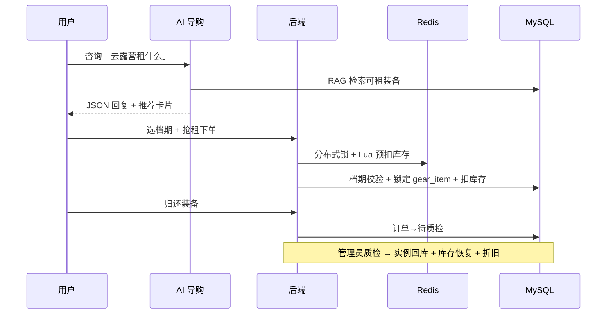

<div align="center">


<br/><br/>

**Spring Boot 3 + Vue 3 全栈实战项目**  
面向 HR / 面试官可快速体验 · 涵盖抢租、档期日历、AI 导购、质检闭环与完整管理后台

<br/>

[](https://github.com/Ckj6818/outdoor-gear-rental/stargazers)
[](https://github.com/Ckj6818/outdoor-gear-rental)
[](docs/HR.md)
[](docs/DEMO.md)
[](LICENSE)

<br/>

[](https://openjdk.org/)
[](https://spring.io/projects/spring-boot)
[](https://vuejs.org/)
[](https://www.mysql.com/)
[](https://redis.io/)
[](docker-compose.yml)

<br/>

[给 HR / 面试官](#-给-hr--面试官) ·
[项目概述](#-项目概述) ·
[功能模块](#-功能模块) ·
[技术亮点](#-技术亮点) ·
[快速开始](#-快速开始) ·
[项目结构](#-项目结构) ·
[API 文档](#-主要-api节选)

</div>

---

## 📑 目录

- [👔 给 HR / 面试官](#-给-hr--面试官)
- [📌 项目概述](#-项目概述)
- [✨ 功能模块](#-功能模块)
- [🛠 技术亮点](#-技术亮点)
- [🧱 技术栈](#-技术栈)
- [🚀 快速开始](#-快速开始)
- [📂 项目结构](#-项目结构)
- [🔌 主要 API（节选）](#-主要-api节选)
- [👤 作者](#-作者)

---

## 👔 给 HR / 面试官

> **3 分钟走通主流程** → [docs/DEMO.md](docs/DEMO.md) · **一页纸能力摘要** → [docs/HR.md](docs/HR.md)

<table>
<tr>
<td width="50%">

### 🎯 这是什么

一套**完整可运行**的户外装备租赁 Web 系统：

- 用户端 · 管理后台 · AI 导购
- 本地启动即可 Live Demo
- 适合校招 / 实习 / 全栈岗位作品集

</td>
<td width="50%">

### 💡 和普通 Demo 的区别

| 能力 | 说明 |
|:--|:--|
| SKU 单件追踪 | 每件装备唯一 SN，借还全程可溯源 |
| Redis Lua 防超卖 | 分布式锁 + 原子预扣减 + 行锁 |
| 档期冲突校验 | 日历选租，归还日不可连租 |
| 轻量级 RAG 导购 | 对话推荐 + 结构化卡片跳转 |
| RBAC + 运营大屏 | 权限隔离 + ECharts 可视化 |

</td>
</tr>
</table>

**完整业务流程：**

```
选品 → AI 推荐 → 档期选择 → 抢租 → 支付 → 归还 → 质检 → 库存恢复
```

**仓库地址：** https://github.com/Ckj6818/outdoor-gear-rental

---

## 📌 项目概述

**山行（Outdoor Gear Rental）** 是个人全栈实战项目，业务闭环完整、代码结构清晰，适合作为**校招 / 实习 / 全栈岗位**的作品集展示。

> 浏览选品 → AI 导购推荐 → 档期日历选租 → 高并发抢租 → 支付借出 → 归还 → 质检 → 库存恢复 / 维修 → 资产折旧 → 运营分析

与「只按数量扣库存」的 Demo 不同，本项目实现 **SPU + SKU/SN 双层模型**：每件装备拥有唯一实例编号，借还全程可溯源。

| 维度 | 说明 |
|:--|:--|
| **项目类型** | 前后端分离全栈 Web 应用 |
| **业务领域** | O2O 租赁 / 库存与资产管理 |
| **代码规模** | 后端 50+ Java 类 · 前端 12+ 页面/组件 · MySQL 核心表 5+ |
| **适用场景** | 作品集 · 技术面试 Live Demo · 工程能力证明 |

---

## ✨ 功能模块

### 👤 用户端

| 模块 | 亮点 |
|:--|:--|
| 🏔 **装备大厅** | 侧栏多选筛选、排序分页、卡片 hover 换图、详情弹窗 |
| 📅 **租赁下单** | 日期区间选择器、占用档期禁用、租金 + 押金自动估算 |
| 🤖 **AI 导购** | 右下角悬浮对话窗，RAG 挂载实时库存，推荐卡片 +「去租赁」跳转 |
| 📋 **我的订单** | Dark Minimalism 卡片式订单页、Tab 筛选、支付/归还/取消 |
| 📰 **内容专栏** | 装备评测 / 户外技能 / 周边路线 / 环保倡议（杂志风 UI） |

### 🛡 管理后台（RBAC · 仅管理员）

| 模块 | 路径 | 亮点 |
|:--|:--|:--|
| 📊 **运营数据大屏** | `/admin/dashboard` | ECharts 营收趋势、品类占比、核心 KPI |
| 📦 **订单管理** | `/admin/orders` | 状态分布 / 流水趋势 / TOP 装备 + 订单表格 |
| 🎒 **装备管理** | `/admin/gears` | 装备 CRUD、图片预览、上下架切换 |
| 👥 **管理员账号** | `/admin/users` | 管理员增删改、启用/禁用 |

### 🔄 业务流程



---

## 🛠 技术亮点

<table>
<tr>
<td align="center" width="25%"><strong>📦 库存模型</strong><br/><br/><code>gear_info</code> + <code>gear_item</code><br/>SKU 单件全生命周期追踪</td>
<td align="center" width="25%"><strong>⚡ 高并发抢租</strong><br/><br/>Redisson 锁<br/>Redis Lua 预扣减<br/>MySQL 行锁</td>
<td align="center" width="25%"><strong>📅 租赁档期</strong><br/><br/>占用区间 API<br/>闭区间冲突算法<br/>日历选租交互</td>
<td align="center" width="25%"><strong>🤖 AI 导购</strong><br/><br/>轻量级 RAG<br/>Prompt 结构化 JSON<br/>推荐卡片渲染</td>
</tr>
<tr>
<td align="center"><strong>🗄 缓存</strong><br/><br/>Spring Cache + Redis<br/>装备大厅读多写少加速</td>
<td align="center"><strong>🔐 安全</strong><br/><br/>Sa-Token + BCrypt<br/>RBAC 权限隔离</td>
<td align="center"><strong>📝 审计</strong><br/><br/><code>@LogOperation</code> AOP<br/>操作人 / IP / 耗时</td>
<td align="center"><strong>🎨 前端</strong><br/><br/>Vue 3 + Element Plus<br/>ECharts 数据可视化</td>
</tr>
</table>

<details>
<summary><strong>📋 详细技术对照表</strong></summary>

| 类别 | 实现 | 价值 |
|:--|:--|:--|
| **库存模型** | `gear_info` + `gear_item` SKU 追踪 | 单件装备全生命周期 |
| **高并发抢租** | Redisson 锁 + Redis Lua 预扣减 + MySQL 行锁 | 三层防护防超卖 |
| **租赁档期** | 占用区间 API + 闭区间冲突算法 | 日历选租、归还日不可连租 |
| **AI 导购** | 轻量级 RAG + Prompt 结构化 JSON | 对话式推荐、缩短决策链路 |
| **缓存** | Spring Cache + Redis | 装备大厅读多写少加速 |
| **安全** | Sa-Token + BCrypt + RBAC | 无状态 Token 鉴权、权限隔离 |
| **审计** | `@LogOperation` AOP | 操作人 / IP / 耗时记录 |
| **前端** | Vue 3 + Element Plus + ECharts | 商业化 UI + 数据可视化 |

</details>

---

## 🧱 技术栈

```
┌─────────────────────────────────────────────────────────────────┐
│  Frontend   │  Vue 3 · Vite · Element Plus · ECharts · Axios   │
├─────────────────────────────────────────────────────────────────┤
│  Backend    │  Java 17 · Spring Boot 3 · MyBatis-Plus · Sa-Token│
├─────────────────────────────────────────────────────────────────┤
│  Middleware │  MySQL 8 · Redis · Redisson · Knife4j (Swagger)  │
├─────────────────────────────────────────────────────────────────┤
│  DevOps     │  Docker Compose · PowerShell 启动脚本 · SQL 迁移    │
├─────────────────────────────────────────────────────────────────┤
│  AI (可选)  │  DeepSeek 等 OpenAI 兼容 Chat Completions API     │
└─────────────────────────────────────────────────────────────────┘
```

---

## 🚀 快速开始

### 环境要求

| 依赖 | 版本 |
|:--|:--|
| JDK | 17+ |
| Maven | 3.9+ |
| Node.js | 18+ |
| MySQL | 8+ |
| Redis | 6+ |
| Docker | 可选 |

### 方式 A：Docker 一键编排（推荐演示）

```powershell
git clone https://github.com/Ckj6818/outdoor-gear-rental.git
cd outdoor-gear-rental

# 仅启动 MySQL + Redis（本地开发后端/前端）
docker compose -p outdoor-gear up -d mysql redis

# 或构建并启动全栈（MySQL + Redis + 后端 + 前端 Nginx）
docker compose up -d --build
```

| 访问地址 | URL |
|:--|:--|
| 🌐 前端（全栈模式） | http://localhost |
| 📖 API 文档（Knife4j） | http://localhost:8081/doc.html |

> 默认 MySQL 密码：`123456`（可通过环境变量 `MYSQL_PASSWORD` 覆盖）

### 方式 B：本地开发（前后端分离）

```powershell
# 1. 初始化数据库（首次）
mysql -u root -p < sql/init.sql

# 已有库时按需执行增量脚本，例如：
#   sql/seed_gear_items.sql      — 补全 gear_item 实例（下单必需）
#   sql/fix_user_passwords.sql   — 修复测试账号 BCrypt 密码

# 2. 复制本地配置（MySQL 密码、可选 AI Key）
copy src\main\resources\application-local.yml.example src\main\resources\application-local.yml

# 3. 一键启动（会打开两个 PowerShell 窗口）
.\scripts\run-dev.ps1
# 停止：.\scripts\stop-dev.ps1
```

<details>
<summary><strong>🔧 手动分步启动</strong></summary>

```powershell
$env:MYSQL_PASSWORD = "123456"
.\scripts\run-backend.ps1    # → http://localhost:8081
.\scripts\run-frontend.ps1   # → http://localhost:5173
```

</details>

<details>
<summary><strong>💡 Cursor / VS Code 开发提示</strong></summary>

日常开发请用上方脚本或 **Tasks: Run Task → 全栈开发**，避免用「断点调试」启动 Vite/Spring Boot，否则停止调试会连带中断服务。

**AI 导购（可选）：** 在 `application-local.yml` 或环境变量 `AI_API_KEY` 中配置 DeepSeek 等 OpenAI 兼容 API Key。未配置时自动启用 Mock 模式（基于库存关键词推荐，便于答辩演示）。

> **注意：** 修改后端 Java 代码后需重启 Spring Boot，新接口才会生效。

</details>

### 🔑 测试账号

| 角色 | 账号 | 密码 | 权限 |
|:--|:--|:--|:--|
| 👑 管理员 | `admin` | `123456` | 运营大屏 · 订单质检 · 装备/用户管理 |
| 👤 用户 | `zhangsan` | `123456` | 装备浏览 · 租赁下单 · 我的订单 |

---

## 📂 项目结构

```
outdoor-gear-rental/
├── docs/
│   ├── assets/banner.svg     # README 顶部横幅
│   ├── HR.md                 # 给 HR 的一页纸说明 ⭐
│   └── DEMO.md               # 3 分钟体验指南 ⭐
├── docker-compose.yml        # MySQL + Redis + 全栈编排
├── scripts/                  # run-dev / stop-dev 等启动脚本
├── sql/                      # init.sql + 增量迁移
├── src/main/java/            # Spring Boot 后端
│   └── com/outdoor/rental/
│       ├── service/RedisGearStockService.java          # Lua 库存预扣减
│       ├── service/impl/AiConsultantServiceImpl.java   # RAG 导购
│       └── service/impl/RentalOrderServiceImpl.java    # 档期冲突校验
└── frontend/src/
    ├── components/
    │   ├── AiChatBox.vue           # AI 导购对话窗
    │   └── GearBookingModal.vue    # 档期选择下单弹窗
    ├── views/                      # 用户端 + admin 管理页
    └── api/                        # Axios 接口封装
```

---

## 🔌 主要 API（节选）

| 方法 | 路径 | 说明 |
|:--|:--|:--|
| `POST` | `/api/auth/login` | 登录 |
| `GET` | `/api/gears` | 装备列表（缓存） |
| `POST` | `/api/orders` | 下单抢租 |
| `GET` | `/api/orders/occupied-dates/{gearId}` | 装备已占用档期（日历禁用） |
| `POST` | `/api/ai/consult` | AI 导购对话（返回 JSON 字符串） |
| `GET` | `/api/admin/dashboard/stats` | 运营大屏 |
| `GET` | `/api/admin/system/gear` | 装备管理 |
| `GET` | `/api/admin/system/user` | 管理员管理 |
| `POST` | `/api/admin/orders/inspect` | 质检闭环 |
| `GET` | `/doc.html` | Knife4j 接口文档 |

完整接口请访问运行中的 **Knife4j 文档** → http://localhost:8081/doc.html

---

## 👤 作者

<div align="center">

**GitHub：** [@Ckj6818](https://github.com/Ckj6818)

个人全栈实战项目 · 欢迎 ⭐ **Star** · 问题请提 [Issue](https://github.com/Ckj6818/outdoor-gear-rental/issues)

<br/>

[](https://github.com/Ckj6818/outdoor-gear-rental)

</div>

---

## 📄 License

本项目采用 [MIT License](LICENSE) 开源。
